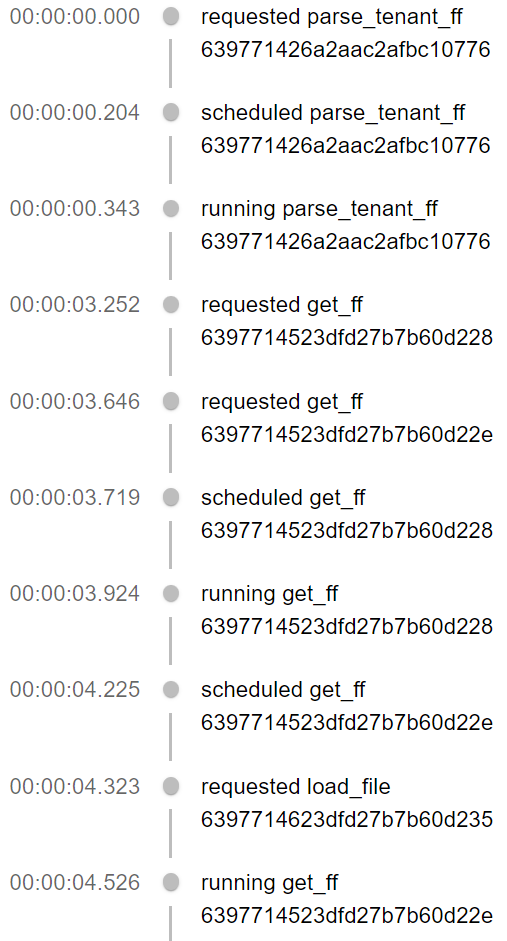

# react-stackstorm

This is a [Next.js](https://nextjs.org/) project using React, Material-UI and xstate to
invoke a [Stackstorm](https://stackstorm.com/) action or workflow and show a timeline of the
results.

[xstate](https://xstate.js.org/docs/) is used to orchestate the multiple API calls needed.

Note: This is an _example_ and will not run directly in your environment as it uses
      a custom authentication hack to link our SSO to ST2 auth-token

Note: This example is NOT using ST2 event stream, which could shortcut a lot of the
      API calls



## Prerquisites

* node
* nextjs
* yarn
* a working stackstorm deployment
* a workflow to invoke

## Getting Started

Download this repo and run

``` bash
$ yarn install
$ yarn build && yarn start
```

Open [http://localhost:3000](http://localhost:3000) with your browser to see the result.
